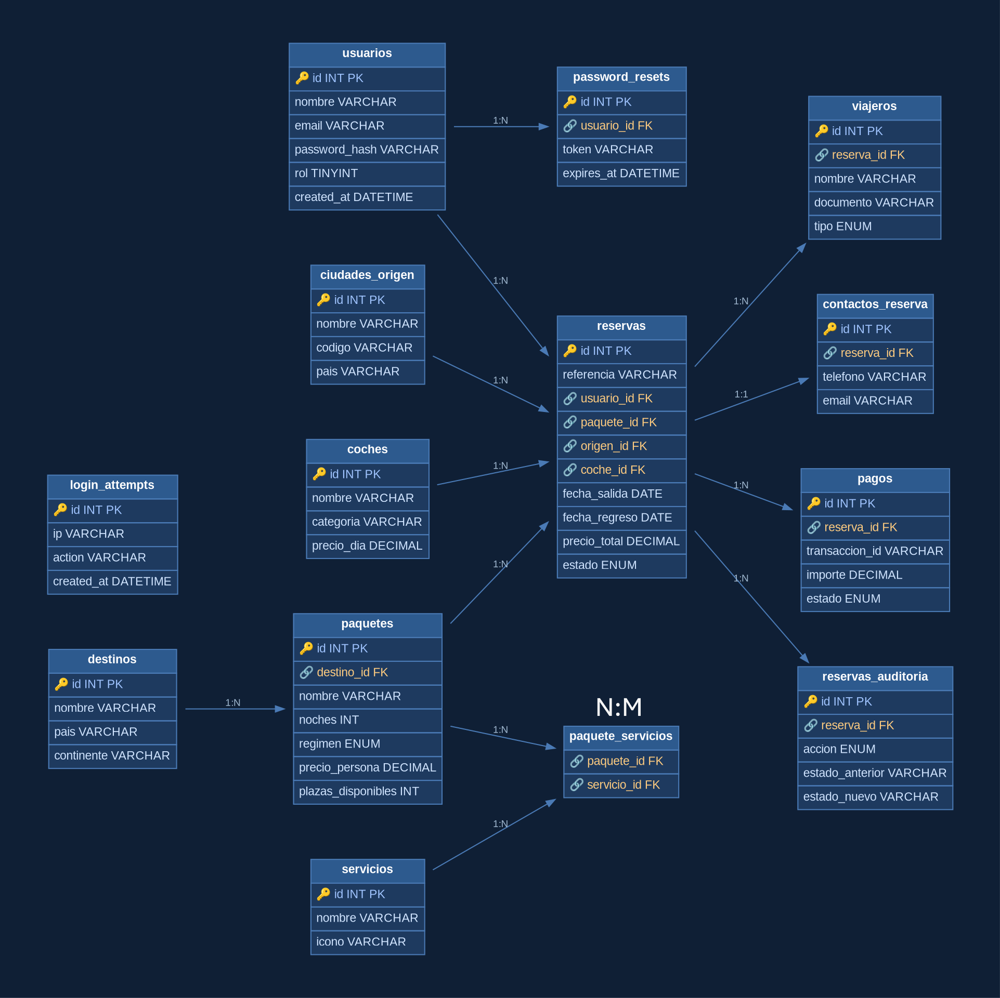

## RP Travels

> **TFG del Ciclo Formativo de Grado Superior — Administración de Sistemas Informáticos en Red (ASIR)**

Aplicación web de una agencia de viajes. Permite buscar y comparar paquetes
(vuelos, hoteles, paquetes, cruceros, circuitos y escapadas), reservar online con
seguro de cancelación opcional y alquiler de coche, gestionar el perfil de usuario
y administrar todo el sitio desde un panel privado.

---

## Autores

- **Pedro Trujillo Jurca**
- **Raquel Romero Morilla**

Ciclo: Grado Superior de ASIR · Curso académico 2025/2026

---

## Enlaces

| 📄 Anteproyecto (PDF público) | `http://rptravelstfg.notion.site/Anteproyecto-Web-Agencia-de-Viajes-b117a99ff980825595e401c33bd304ab` |
| 🌐 Aplicación desplegada       | `https://rp-web-anux.onrender.com/` |
| 🎬 Vídeo de presentación (máx. 10 min) | `https://youtu.be/sYs_u2pMG3s` |
| 🗂️ Repositorio versión desplegada en internet   | `https://github.com/pedro27K/RP-Web/` |
| 🗂️ Repositorio versión local   | `https://github.com/pedro27K/RP-Local/` |

---

## Tecnologías utilizadas

- **Backend**: PHP 8.2 + PDO + MySQL 8
- **Frontend**: HTML5, CSS3 y JavaScript *vanilla* (sin frameworks)
- **Servidor web**: Apache 2.4
- **Contenedores**: Docker y Docker Compose (desarrollo) · Kubernetes (despliegue)
- **Correo saliente**: PHPMailer + Gmail (con contraseña de aplicación)
- **Dependencias PHP**: Composer (PHPMailer ^7.1)
- **Control de versiones**: Git + GitHub

---

## Estructura del proyecto

```
RP/
├── admin/         Panel de administración (PHP renderizado en servidor)
│   ├── login.php / logout.php / auth-check.php
│   ├── dashboard.php      KPIs y estadísticas
│   ├── packages.php / package-edit.php
│   ├── destinations.php
│   ├── users.php / user-edit.php
│   ├── bookings.php / send-booking-email.php
│   ├── css/               Estilos del panel
│   └── partials/          Sidebar reutilizable
├── api/           Endpoints JSON (api.php, auth.php) + config y helpers
├── assets/        Imágenes de destinos y vídeo de fondo
├── css/           Hojas de estilo separadas por sección
├── docs/          Documentación: diagrama E/R, manual de usuario, diario
├── fonts/         Tipografía Plus Jakarta Sans
├── includes/      Fragmentos PHP comunes (nav, footer, sesión)
├── k8s/           Manifiestos de Kubernetes (Deployments, Services, Secret)
├── scripts/       Shell scripts: copias de seguridad y restauración
├── sql/           Scripts SQL: rp.sql (producción)
├── tools/         Worker multiproceso (recordatorios.php)
├── index.php      Punto de entrada de la web pública
├── paquete.php    Detalle de un paquete
├── resultados.php Resultados de búsqueda
├── reserva.php    Confirmación de reserva
├── perfil.php     Perfil del usuario
├── login.php / logout.php
├── .env.example   Plantilla de variables de entorno
├── composer.json  Dependencias PHP
├── Dockerfile
├── docker-compose.yml
└── entrypoint.sh  Inicialización del contenedor
```

---

## Modelo de datos (Esquema E/R)

La base de datos es **relacional (MySQL 8)** y consta de 14 tablas. El diagrama
muestra las entidades, sus claves primarias y foráneas y las relaciones.
 

El script completo de la base de datos está en [`sql/rp.sql`](sql/rp.sql).
Incluye las tablas con sus datos, los triggers de auditoría y los usuarios de BD
con sus privilegios, todo en un único archivo.

---

## Puesta en marcha con Docker (recomendado)

1. Clonar el repositorio.
2. Crear el archivo de entorno a partir de la plantilla y rellenarlo:
   ```bash
   cp .env.example .env
   nano .env
   ```
3. Levantar los servicios:
   ```bash
   docker compose up -d --build
   ```
4. Abrir en el navegador:
   - Web: <http://localhost:8080>
   - phpMyAdmin: <http://localhost:8081>

La base de datos se crea automáticamente la primera vez con `sql/rp.sql`
(tablas, datos, triggers y usuarios de BD incluidos).

## Puesta en marcha sin Docker (XAMPP)

1. Copiar la carpeta en `C:\xampp\htdocs\RP`.
2. Importar `sql/rp-local.sql` desde phpMyAdmin.
3. Crear `.env` a partir de `.env.example` apuntando a `localhost`.
4. Acceder a <http://localhost/RP>.

## Despliegue en Kubernetes

Ver la guía detallada en [`k8s/README.md`](k8s/README.md).

---

## Variables de entorno

| Variable    | Descripción                          |
|-------------|--------------------------------------|
| `DB_HOST`   | Hostname del servidor MySQL          |
| `DB_PORT`   | Puerto de MySQL (por defecto 3306)   |
| `DB_USER`   | Usuario de la base de datos          |
| `DB_PASS`   | Contraseña de la base de datos       |
| `DB_NAME`   | Nombre de la base de datos           |
| `MAIL_USER` | Dirección de correo Gmail            |
| `MAIL_PASS` | Contraseña de aplicación de Gmail    |

---

## Copias de seguridad (automáticas)

Las copias se hacen con [`scripts/backup.sh`](scripts/backup.sh) (mysqldump
comprimido con rotación). Para automatizarlas a diario, instala la tarea de
cron de [`scripts/crontab.example`](scripts/crontab.example):

```bash
crontab scripts/crontab.example   # tras ajustar las rutas
```

Restaurar una copia: `./scripts/restore.sh backups/<archivo>.sql.gz`

---

## Tarea programada multiproceso

[`tools/recordatorios.php`](tools/recordatorios.php) envía recordatorios de viaje
repartiendo el trabajo entre varios procesos (`pcntl`):

```bash
docker exec rp_app php tools/recordatorios.php                          # simulacro
docker exec rp_app php tools/recordatorios.php --send                   # envío real
docker exec rp_app php tools/recordatorios.php --days=7 --workers=4 --send
```

---

## Endpoints de la API

Archivo `api/api.php`, parámetro `?action=`:

| Acción             | Método | Descripción                          |
|--------------------|--------|--------------------------------------|
| `origenes`         | GET    | Lista de ciudades de origen          |
| `destinos`         | GET    | Lista de destinos activos            |
| `paquetes`         | GET    | Todos los paquetes (home)            |
| `paquete`          | GET    | Detalle de un paquete por `id`       |
| `buscar`           | GET    | Búsqueda con filtros                 |
| `reservar`         | POST   | Crear reserva (CSRF requerido)       |
| `mis-reservas`     | GET    | Reservas del usuario en sesión       |
| `cancelar-reserva` | POST   | Cancelar reserva (CSRF requerido)    |

Archivo `api/auth.php`: `session`, `login`, `register`, `logout`,
`update-profile`, `forgot-password`, `reset-password`. Todos los POST requieren
la cabecera `X-CSRF-Token` (se inyecta como meta en `index.php`).

---

## Panel de administración

USUARIO:
admin@rp.es
RPadmin123!

Accesible en `admin/login.php`. Requiere un usuario con `rol = 0` en la tabla
`usuarios`. Para crear un administrador: regístrate como usuario normal y
luego promoviónalo desde la base de datos:

```sql
UPDATE usuarios SET rol = 0 WHERE email = 'tu_correo@ejemplo.com';
```

---

## Seguridad implementada

- Contraseñas con `password_hash` (bcrypt)
- Token CSRF por sesión, validado en todos los POST
- *Rate limiting* por IP en login, registro y forgot-password (tabla `login_attempts`)
- Sentencias preparadas PDO en todas las consultas (anti SQL Injection)
- `htmlspecialchars` para evitar XSS + Content Security Policy en `.htaccess`
- Cabeceras de seguridad HTTP (X-Frame-Options, X-Content-Type-Options, etc.)
- `session_regenerate_id` tras login y registro
- Usuarios de BD con privilegios mínimos (`rp_app` para la web; ver `sql/rp.sql`)
- Credenciales fuera del repositorio (`.env` en `.gitignore`)

---

## Manual de usuario

Guía paso a paso con capturas en [`docs/manual_usuario.md`](docs/manual_usuario.md).

---

## Bibliografía

- Documentación oficial de PHP — <https://www.php.net/docs.php>
- Documentación oficial de MySQL 8 — <https://dev.mysql.com/doc/>
- MDN Web Docs (HTML, CSS, JavaScript) — <https://developer.mozilla.org/>
- Documentación de Docker — <https://docs.docker.com/>
- Documentación de Kubernetes — <https://kubernetes.io/docs/>
- Documentación de Apache HTTP Server — <https://httpd.apache.org/docs/>
- PHPMailer — <https://github.com/PHPMailer/PHPMailer>
- OWASP — Buenas prácticas de seguridad web — <https://owasp.org/>

---

## Autoría

Proyecto desarrollado como Trabajo de Fin de Grado del Ciclo Superior de ASIR,
curso 2025/2026.
