# Manual de usuario — RP Travels

Guía práctica para usar la aplicación.

---

## 1. Página de inicio

Al entrar en la web verás el buscador principal y los paquetes destacados.

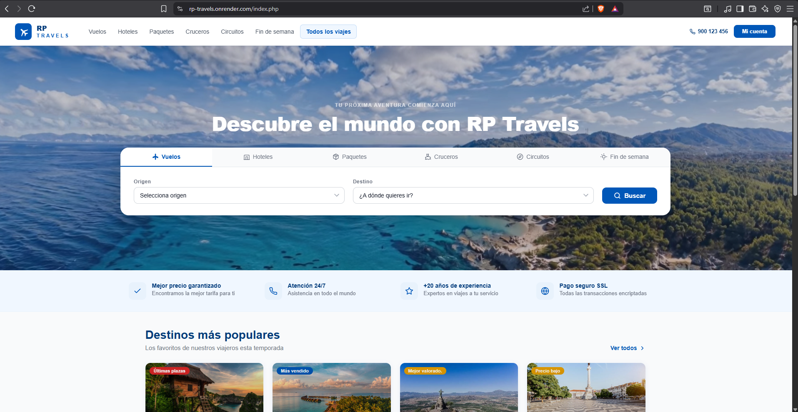

Desde el menú superior puedes navegar por tipos de viaje (vuelos, hoteles,
cruceros…), iniciar sesión o registrarte (Arriba a la derecha, boton  "Mi cuenta").

---

## 2. Registro de una cuenta

1. Pulsa **"Mi cuenta"** y luego **"Crear cuenta"**.
2. Rellena nombre, apellidos, correo y contraseña.
3. Pulsa **"Crear cuenta gratuita"**.

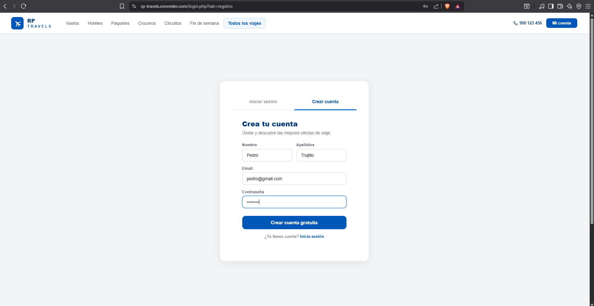

---

## 3. Iniciar sesión

Introduce tu correo y contraseña.
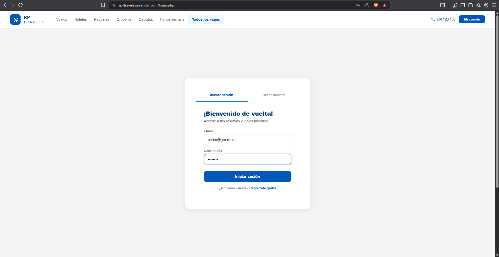

---

## 4. Buscar y filtrar viajes

Usa el buscador tipo de viajes (arriba), origen y buscar para ver los resultados.
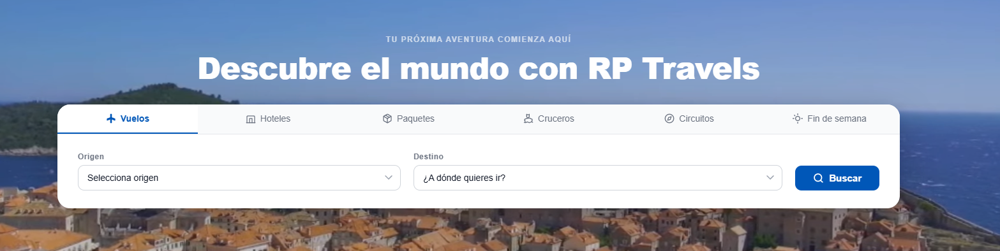
Puedes filtrar con los filtros que hay a la izquierda(precio, régimen, duración…).
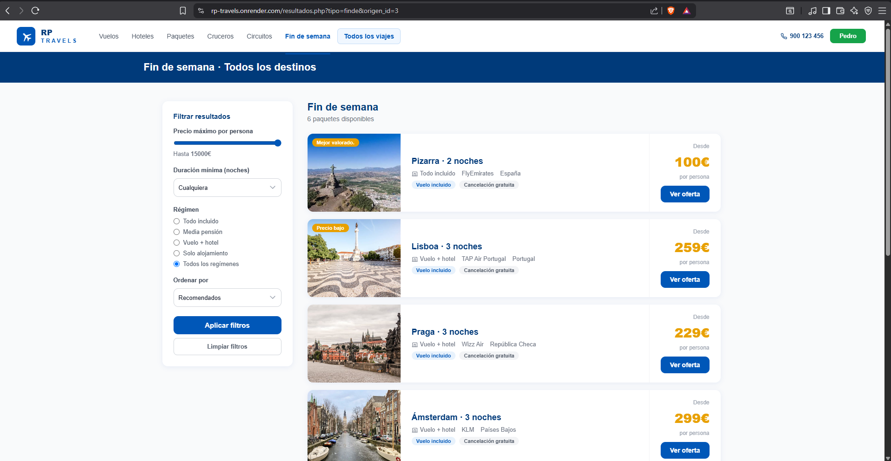

---

## 5. Ver el detalle de un paquete

Al pulsar en un viaje verás su descripción, lo que incluye, el número de
plazas disponibles y el precio por persona.

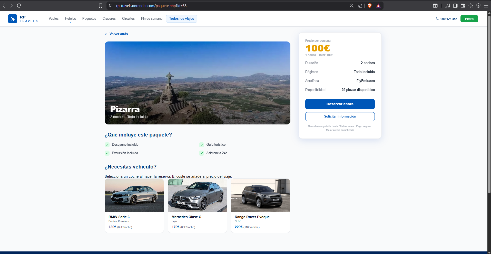

---

## 6. Hacer una reserva

1. Pulsa **"Reservar ahora"** en el paquete elegido.
2. Indica el número de adultos y niños y las fechas.
3. Rellena los datos de cada viajero.
4. (Opcional) Añade **seguro de cancelación** y **alquiler de coche**.
5. Completa el pago con la pasarela (datos de tarjeta).
6. Recibirás una **referencia de reserva** y un correo de confirmación.

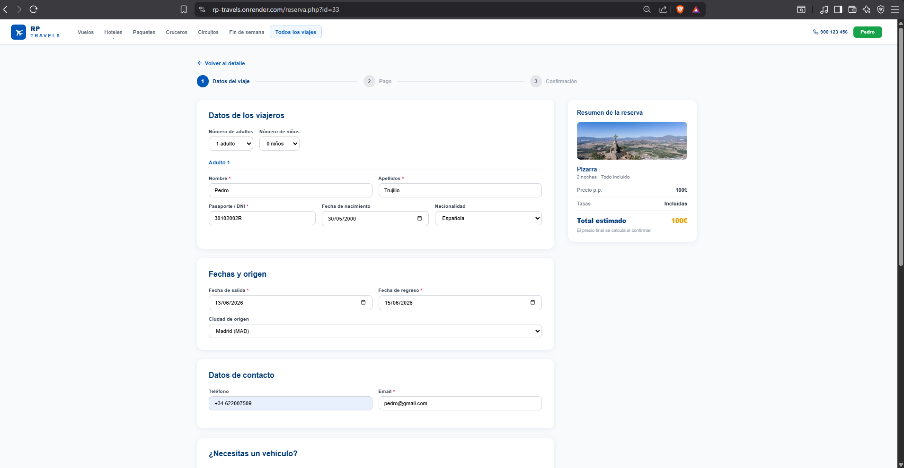

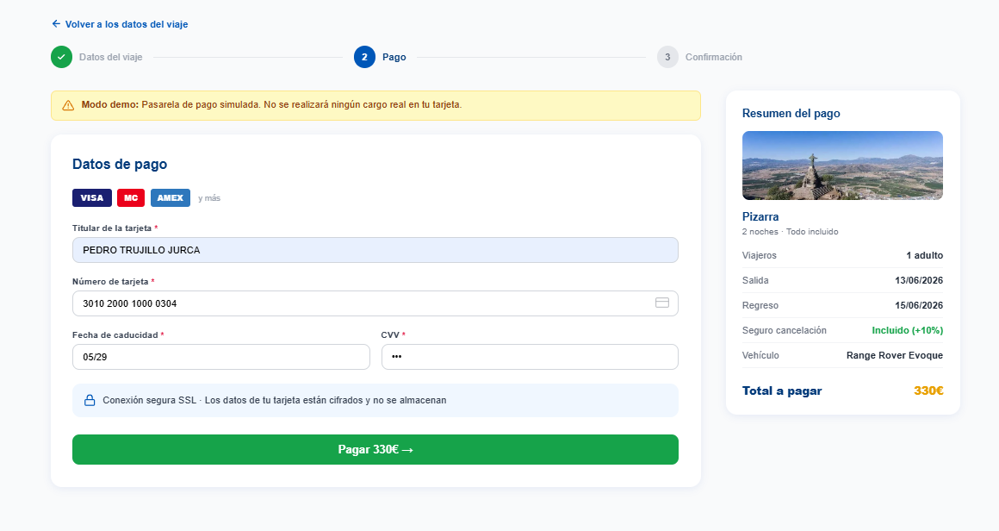

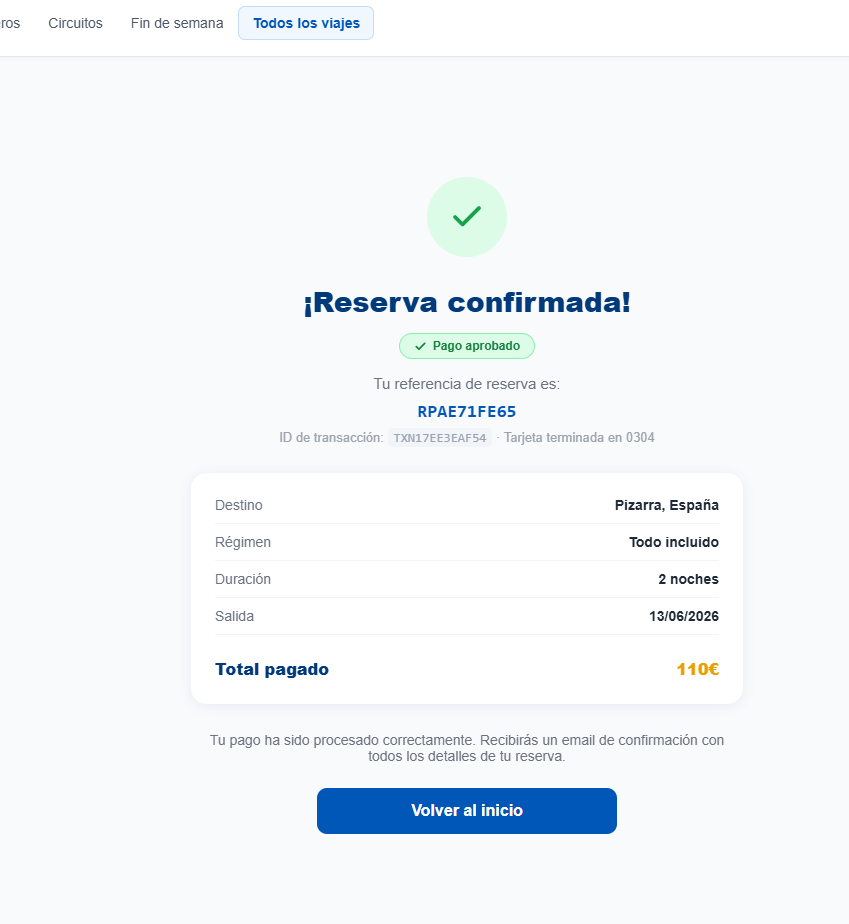

---

## 7. Tu perfil y tus reservas

Desde **"Mi perfil"** (Nombre del usuario, botón verde arriba a la derecha) 
puedes editar tus datos y consultar el historial de
reservas. También puedes **cancelar** una reserva (si tienes seguro de
cancelación se gestiona desde aquí).

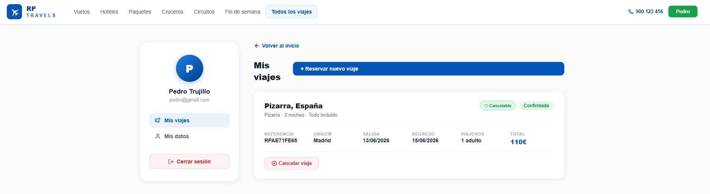

---

## 8. Panel de administración

> Sólo para usuarios administradores (`rol = 0`).
Usuario: admin@rp.es 
Contraseña: RPadmin123!

Puedes acceder iniciando sesión como usuario normal y darle arriba a la derecha "Panel de administrador"
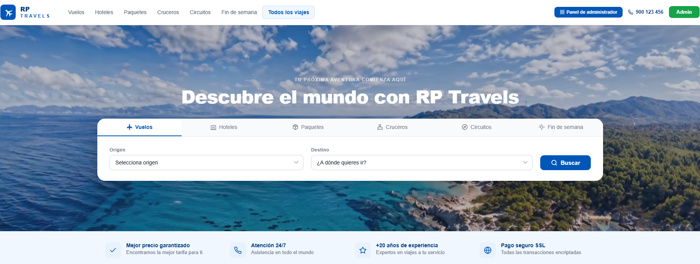

O Acceder en `admin/login.php`. El panel permite:

- **Dashboard** con KPIs: ingresos, reservas activas, destinos más visitados y usuarios.
- Gestionar **paquetes** (crear, editar, activar/desactivar).
- Gestionar **destinos**.
- Ver y gestionar **reservas** (y reenviar el correo de confirmación).
- Gestionar **usuarios**.

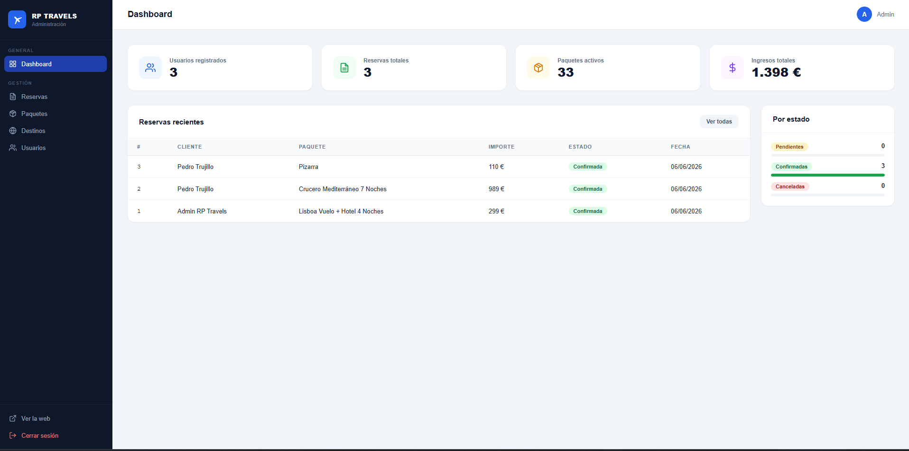

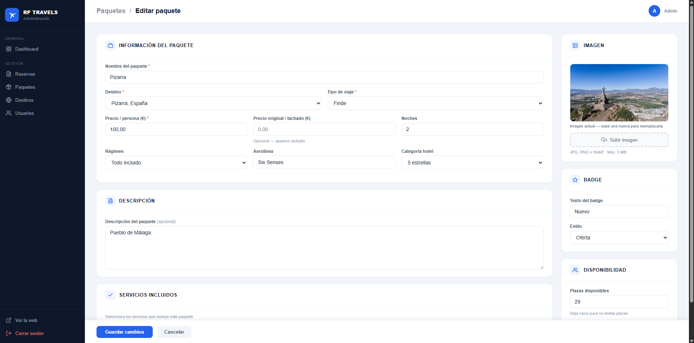

---

## 9. Cerrar sesión

Pulsa tu nombre en el menú superior y selecciona **"Cerrar sesión"**.
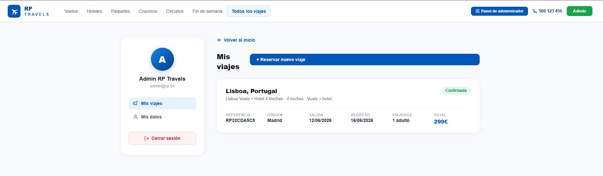
